

  </img>

# About our project
The aim of the PedalaMi project is a simple and user-friendly design as well as to offer the best
possible user experience while cycling in a city. This project promotes the use of bikes as a green and
sustainable alternative to non-zero-emission vehicles, which still are the most preferred choice in the
field. This is achieved by providing users with an interactive system that facilitates cycling, thanks to
a fun reward and challenge-based system to enrich the standard riding experience, making it more
attractive to everyday cyclists.
 
# Video Commercial

hthttps://github.com/pedalami/pedalami/blob/833f9c254f40701a87f7167824e70f9142fb9bf1/PedalaMi%20Commercial%20Video.mp4

# DEMO

https://user-images.githubusercontent.com/28793450/149619689-2d34cf03-d9f2-4f4f-8e99-0b0994768e67.mp4

# Screenshots

  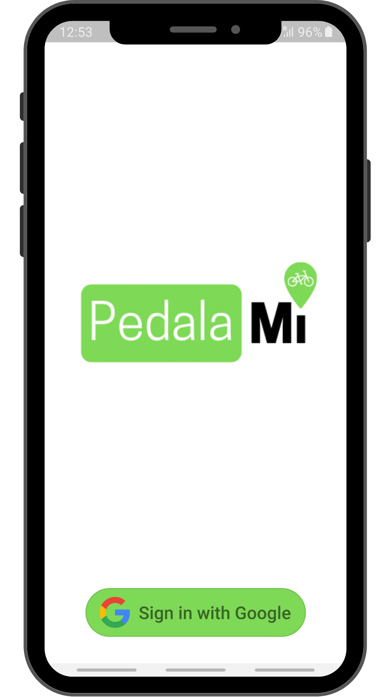</img>

 
Ride a bike in your own city and earn points! Keep track of your movements and try to unlock new badges!
  

  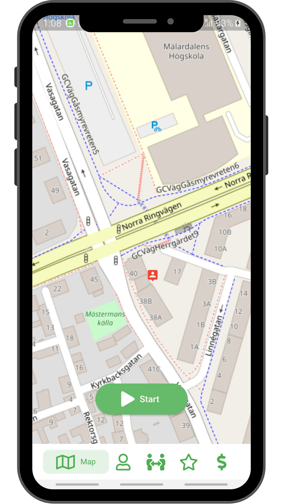</img>
  </img>
  </img>

 
Everything you need is saved in your profile, where you can check your statistics, the badges unlocked and all of your previous rides performed.
Create your own team and challenge your friends!
  

  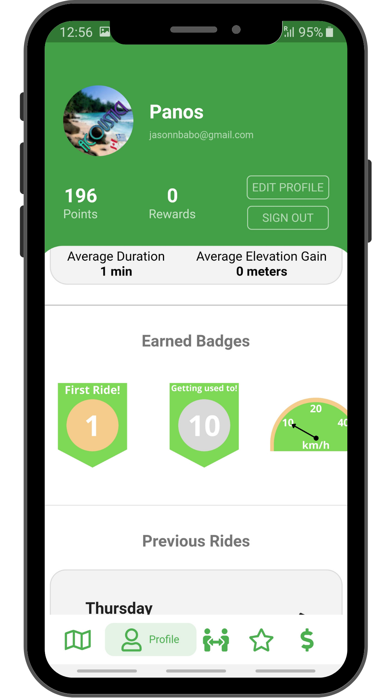</img>
  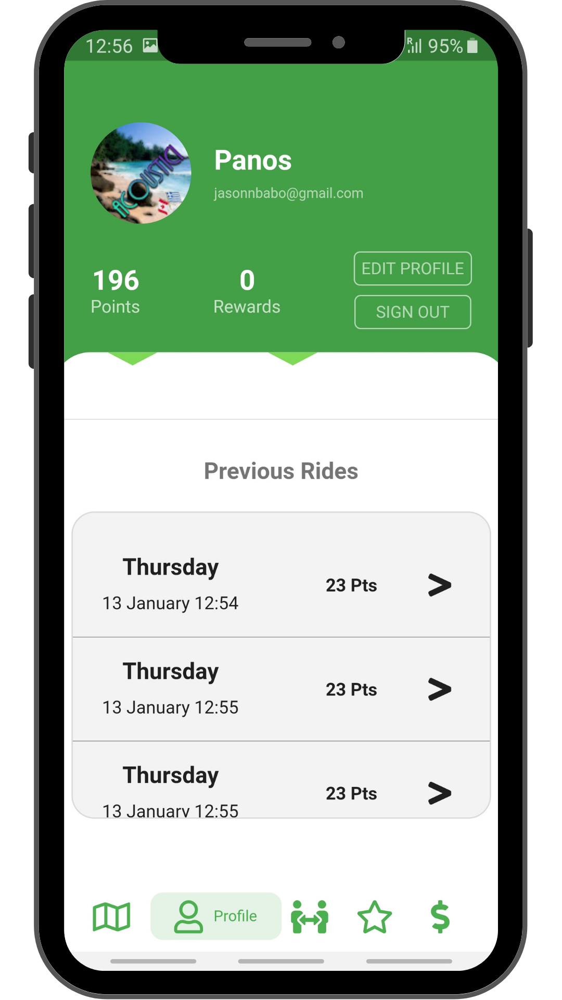</img>
  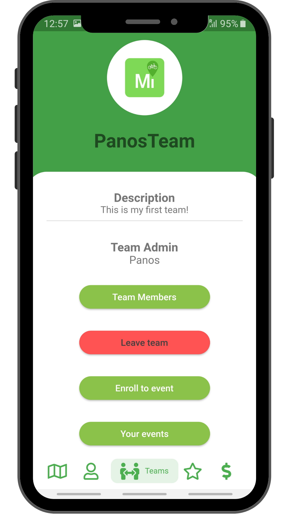</img>

 
Check and enrol into events to earn more points, create new events to challenge other teams and propose new wonderful events to the system! Your event could become public, where everyone can join and have fun with you!
  

  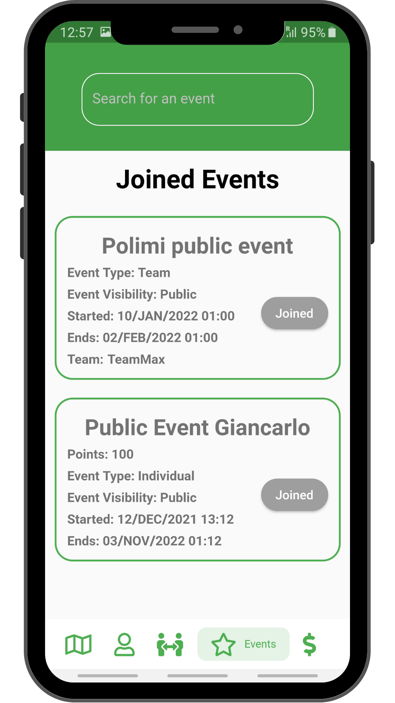</img>
  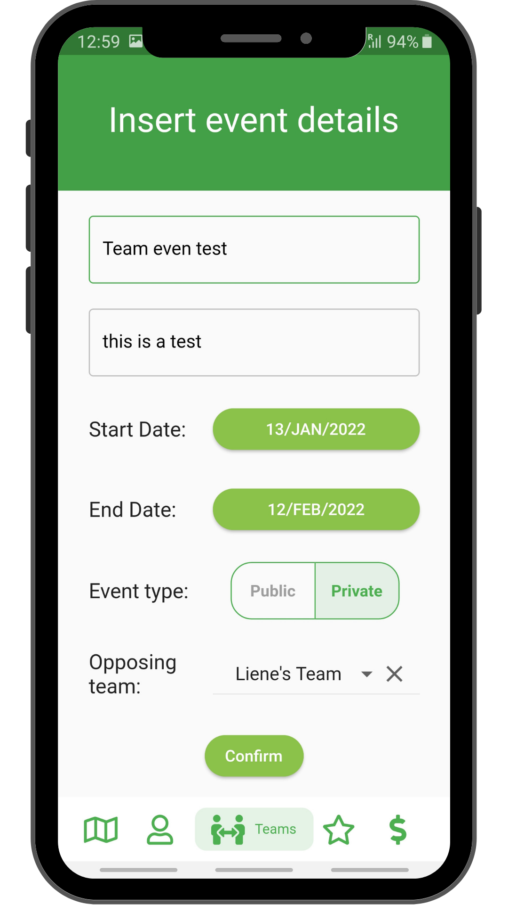</img>
  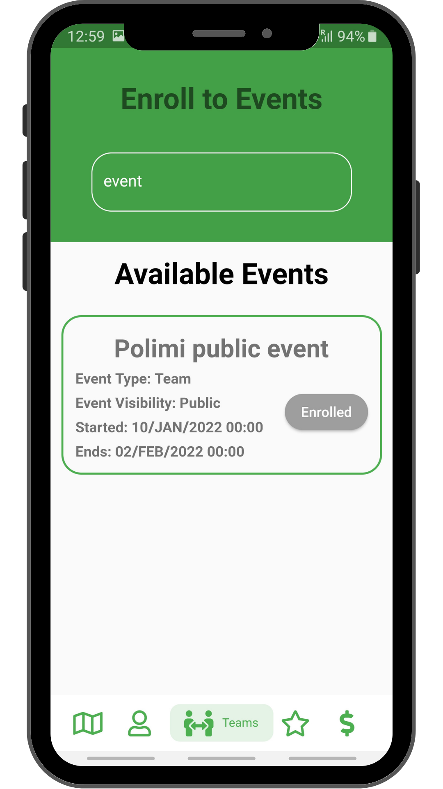</img>

 
Did you earn enough points? Go and get an amazing reward for your hard work, you deserve it!
  

  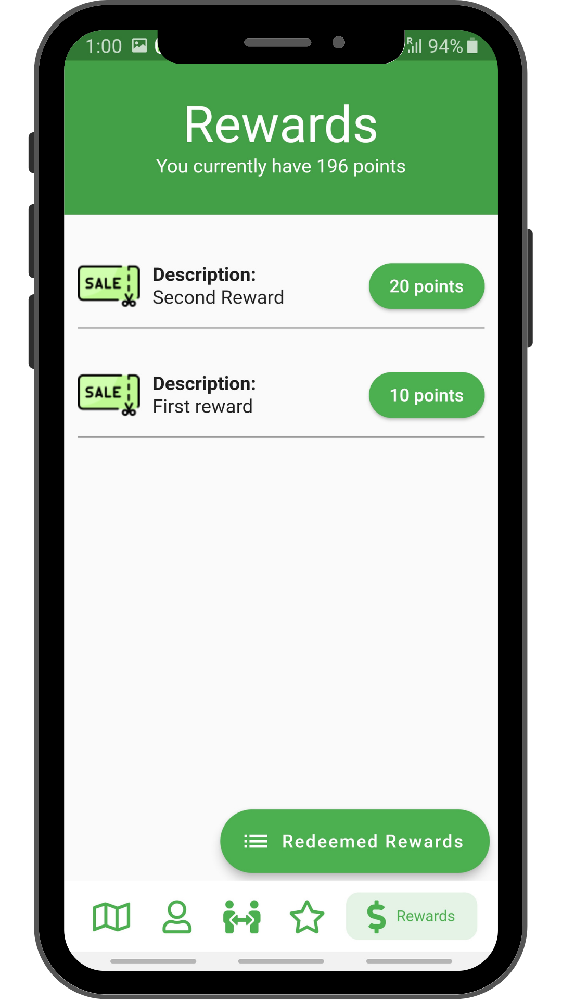</img>
  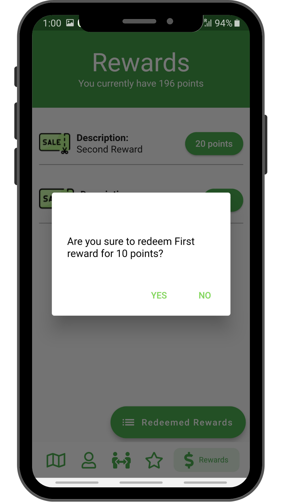</img>
  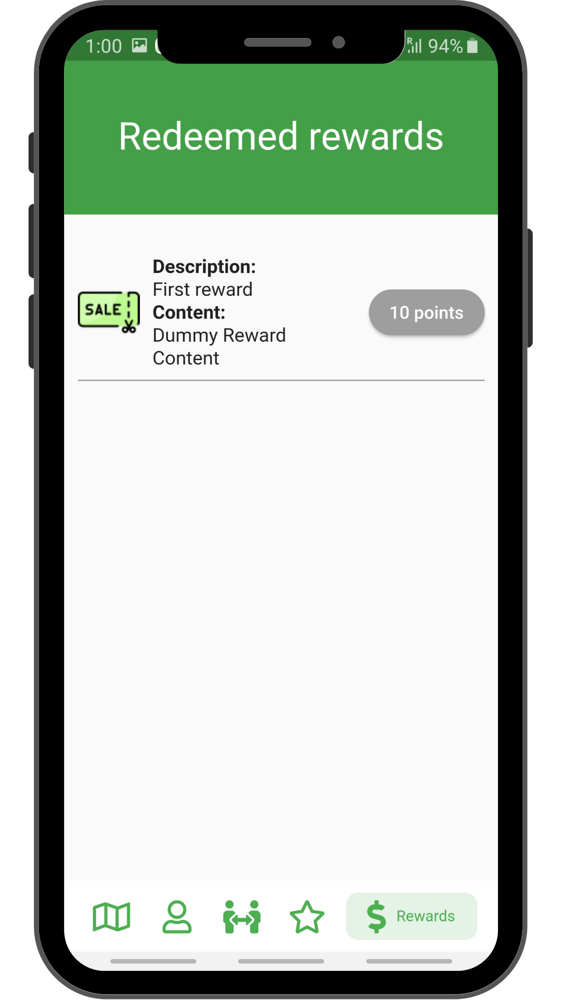</img>

 
And don't forget to check your statistics in the web application: <a href="https://pedala-mi.web.app/">https://pedala-mi.web.app/</a>
  

  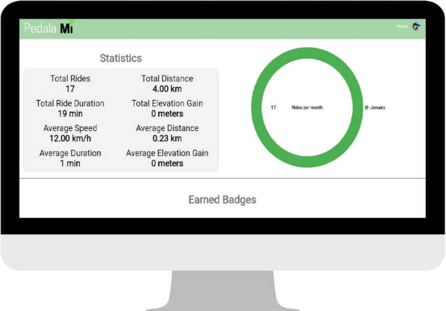</img>

